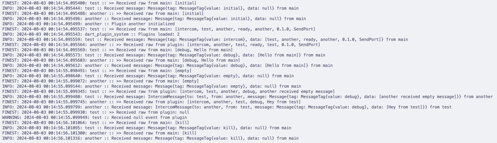

# Dart Plugin System

> **Note:** This project is a Proof of Concept and is not intended to be used in production.

Check Architecture on [architecture.md](docs/architecture.md)

Simple plugin system for Dart. It allows you to load plugins from a directory and execute them, even in AOT mode.

## Build

`dart run tools/builder.dart clean` - Clean the build directories

`dart run tools/builder.dart build` - Build the plugin system in AOT mode

## Run

`dart run example/dart_plugin_system.dart` - Run the plugin system in JIT mode

`./example/dart_plugin_system.exe` - Run the plugin system in AOT mode (need to build first)
